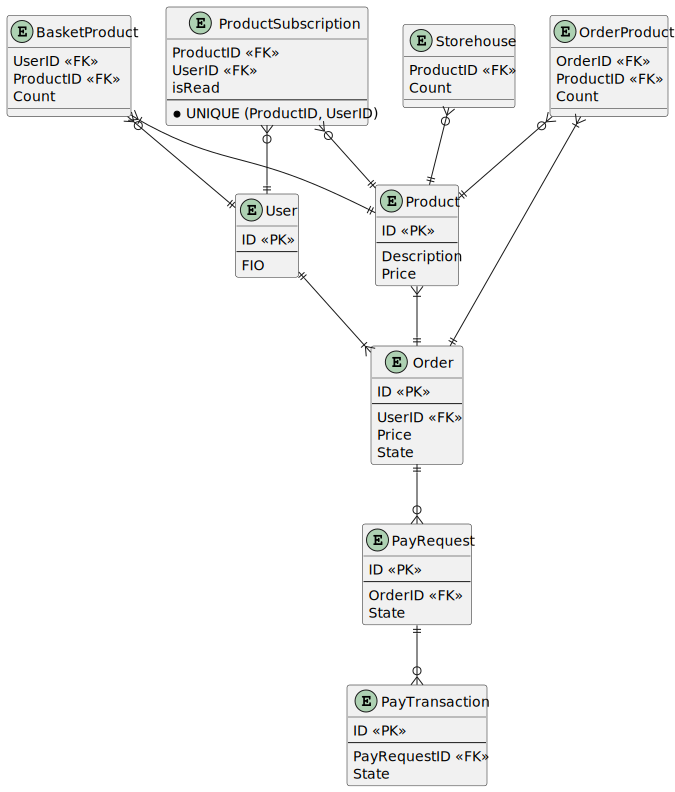

## ERD-схема таблиц БД

### User

**(Пользователи)**

<table>
<thead>
<tr>
	<th>Поле</th>
	<th>Тип</th>
	<th>Обязательно</th>
	<th>Описание</th>
</tr>
</thead>
<tbody>
<tr>
	<td>ID</td>
	<td>int</td>
	<td>PK</td>
	<td>ИД пользователя</td>
</tr>
<tr>
	<td>FIO</td>
	<td>string</td>
	<td>+</td>
	<td>ФИО пользователя</td>
</tr>

</tbody>
</table>

### Product (Товары)

<table>
<thead>
<tr>
	<th>Поле</th>
	<th>Тип</th>
	<th>Обязательно</th>
	<th>Описание</th>
</tr>
</thead>
<tbody>
<tr>
	<td>ID</td>
	<td>int</td>
	<td>PK</td>
	<td>ИД товара</td>
</tr>
<tr>
	<td>Price</td>
	<td>double</td>
	<td>+</td>
	<td>Цена товара за ед. продукции в рублях</td>
</tr>
<tr>
	<td>Description</td>
	<td>string</td>
	<td>+</td>
	<td>Описание товара</td>
</tr>

</tbody>
</table>

### ProductSubscription (Подписки пользователей на приход товара на склад)

<table>
<thead>
<tr>
	<th>Поле</th>
	<th>Тип</th>
	<th>Обязательно</th>
	<th>Описание</th>
</tr>
</thead>
<tbody>
<tr>
	<td>ProductID</td>
	<td>int</td>
	<td>+</td>
	<td>FK на таблицу <b>Product (Товары)</b></td>
</tr>
<tr>
	<td>UserID</td>
	<td>int</td>
	<td>+</td>
	<td>FK на таблицу <b>User (Пользователи)</b></td>
</tr>
</tbody>
</table>

В таблице должно действовать следующее ограничение (CONSTRAINT): `UNIQUE (ProductID, UserID)`.

### Storehouse (Склад товара)

<table>
<thead>
<tr>
	<th>Поле</th>
	<th>Тип</th>
	<th>Обязательно</th>
	<th>Описание</th>
</tr>
</thead>
<tbody>
<tr>
	<td>ProductID</td>
	<td>int</td>
	<td>+</td>
	<td>FK на таблицу <b>Product (Товары)</b></td>
</tr>
<tr>
	<td>Count</td>
	<td>int</td>
	<td>+</td>
	<td>Количество товара на складе</td>
</tr>
</tbody>
</table>

### Order (Заказы)

<table>
<thead>
<tr>
	<th>Поле</th>
	<th>Тип</th>
	<th>Обязательно</th>
	<th>Описание</th>
</tr>
</thead>
<tbody>
<tr>
	<td>ID</td>
	<td>int</td>
	<td>PK</td>
	<td>ИД заказа</td>
</tr>
<tr>
	<td>UserID</td>
	<td>int</td>
	<td>+</td>
	<td>FK на таблицу <b>User (Пользователи)</b></td>
</tr>
<tr>
	<td>Price</td>
	<td>double</td>
	<td>+</td>
	<td>Суммарная цена товара в заказе в рублях</td>
</tr>
<tr>
	<td>State</td>
	<td>string</td>
	<td>+</td>
	<td>Состояние заказа. Может принимать значения:
		<ul>
			<li> 'new' - Новый </li>
			<li> 'checked' - Проверено </li>
			<li> 'work' - В работе </li>
			<li> 'reserved' - Товар зарезервирован </li>
			<li> 'error' - Ошибка оплаты </li>
			<li> 'paid' - Оплачено </li>
			<li> 'canceled' - Отменено </li>
		</ul>
	</td>
</tr>
</tbody>
</table>

### BasketProduct (Товары в корзине)

<table>
<thead>
<tr>
	<th>Поле</th>
	<th>Тип</th>
	<th>Обязательно</th>
	<th>Описание</th>
</tr>
</thead>
<tbody>
<tr>
	<td>UserID</td>
	<td>int</td>
	<td>+</td>
	<td>FK на таблицу <b>User (Пользователи)</b></td>
</tr>
<tr>
	<td>ProductID</td>
	<td>int</td>
	<td>+</td>
	<td>FK на таблицу <b>Product (Товары)</b></td>
</tr>
<tr>
	<td>Count</td>
	<td>int</td>
	<td>+</td>
	<td>Количество товара в корзине</td>
</tr>
</tbody>
</table>

### OrderProduct (Товары в заказе)

<table>
<thead>
<tr>
	<th>Поле</th>
	<th>Тип</th>
	<th>Обязательно</th>
	<th>Описание</th>
</tr>
</thead>
<tbody>
<tr>
	<td>OrderID</td>
	<td>int</td>
	<td>+</td>
	<td>FK на таблицу <b>Order (Заказы)</b></td>
</tr>
<tr>
	<td>ProductID</td>
	<td>int</td>
	<td>+</td>
	<td>FK на таблицу <b>Product (Товары)</b></td>
</tr>
<tr>
	<td>Count</td>
	<td>int</td>
	<td>+</td>
	<td>Количество товара в корзине</td>
</tr>
</tbody>
</table>

### PayRequest (Запросы на оплату)

<table>
<thead>
<tr>
	<th>Поле</th>
	<th>Тип</th>
	<th>Обязательно</th>
	<th>Описание</th>
</tr>
</thead>
<tbody>
<tr>
	<td>ID</td>
	<td>int</td>
	<td>PK</td>
	<td>ИД зароса на оплату</td>
</tr>
<tr>
	<td>OrderID</td>
	<td>int</td>
	<td>+</td>
	<td>FK на таблицу <b>Order (Заказы)</b></td>
</tr>
<tr>
	<td>State</td>
	<td>string</td>
	<td>+</td>
	<td>Состояние запроса на оплату. Может принимать значения:
		<ul>
			<li> 'new' - Новый </li>
			<li> 'checked' - Проверено </li>
			<li> 'work' - В работе </li>
			<li> 'reserved' - Товар зарезервирован </li>
			<li> 'error' - Ошибка оплаты </li>
			<li> 'paid' - Оплачено </li>
			<li> 'canceled' - Отменено </li>
		</ul>
	</td>
</tr>
</tbody>
</table>

### PayTransaction (Транзакции оплат)

<table>
<thead>
<tr>
	<th>Поле</th>
	<th>Тип</th>
	<th>Обязательно</th>
	<th>Описание</th>
</tr>
</thead>
<tbody>
<tr>
	<td>ID</td>
	<td>int</td>
	<td>PK</td>
	<td>ИД Транзакции</td>
</tr>
<tr>
	<td>T_UUID</td>
	<td>uuid</td>
	<td>-</td>
	<td>UUID Транзакции, получаемый с платежного шлюза</td>
</tr>
<tr>
	<td>PayRequestID</td>
	<td>int</td>
	<td>+</td>
	<td>FK на таблицу <b>PayRequest (Запросы на оплату)</b></td>
</tr>
<tr>
	<td>State</td>
	<td>string</td>
	<td>+</td>
	<td>Состояние запроса на оплату. Может принимать значения:
		<ul>
			<li> 'new' - Новый </li>
			<li> 'checked' - Проверено </li>
			<li> 'work' - В работе </li>
			<li> 'reserved' - Товар зарезервирован </li>
			<li> 'error' - Ошибка оплаты </li>
			<li> 'paid' - Оплачено </li>
			<li> 'canceled' - Отменено </li>
		</ul>
	</td>
</tr>
</tbody>
</table>
