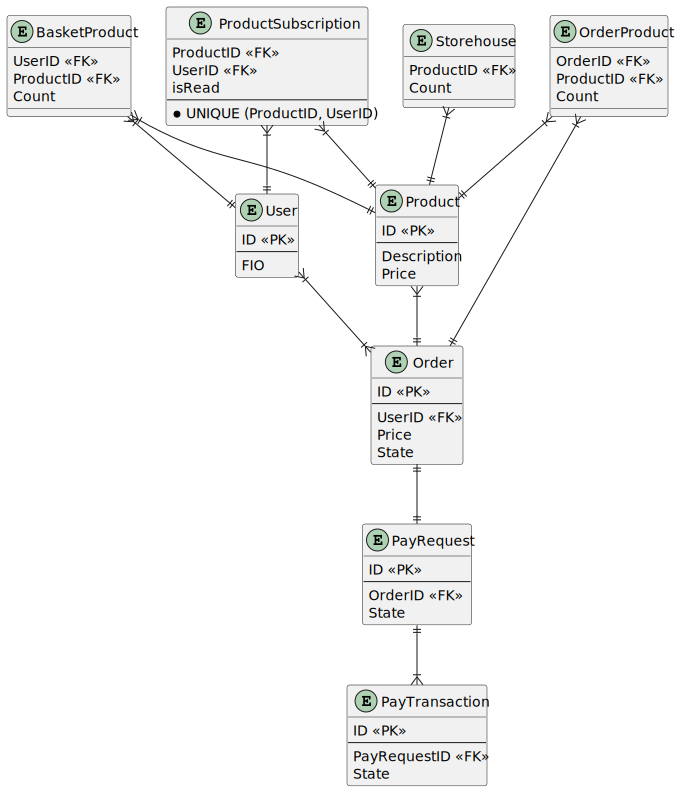

# Интернет магазин

Локальный адрес интернетмагазина: \{base_url} = http://marketplace.local
## [Задание](./testDescription.md)

<<<<<<< HEAD
## [Cхема работы с уведомлениями о поступлении товара](./subscribtion.md)

## [ERD-схема таблиц БД](./ERD.md)

### [Таблица User (Пользователи)](./ERD.md/#User)
=======
Имеется web приложение (интернет магазин) которое состоит из следующих компонентов:
- Каfka
- Backend приложение
- Сервер БД MySQL
- Frontend приложение (SPA)

Описать процесс покупки товара (от корзины пользователя до момента оплаты и получения товара).

Для совершения покупок пользователи авторизуются.

У них есть личный кабинет где они могут посмотреть список купленных товаров.

Для обмена данных между клиентом и сервером, как мы вчера уточнили, используется REST.

Допустим мы хотим расширить функционал данного магазина таким образом:

- Если пользователь выбирает товар для покупки а товара нет на складе мы должны давать ему возможность для подписки на событие поступления товара на склад.
- По факту поступления товара на склад пользователь должен получить уведомление в личном кабинете.
- После того как уведомление будет прочитано его статус должен переходить на прочитано (read).
- У пользователя должно быть список своих уведомлений.

Требуется системный анализ для реализации данного функционала и по его итогам подготовить FS задачу для разработчика.

PS. Нужно подчеркнуть и описать все необходимые и важные процессы как мы вчера обсуждали во время собеседования.

## Cхема работы с уведомлениями о поступлении товара

## ERD-схема таблиц БД

### User (Пользователи)

<table>
<thead>
<tr>
	<th>Поле</th>
	<th>Тип</th>
	<th>Обязательно</th>
	<th>Описание</th>
</tr>
</thead>
<tbody>
<tr>
	<td>ID</td>
	<td>int</td>
	<td>PK</td>
	<td>ИД пользователя</td>
</tr>
<tr>
	<td>FIO</td>
	<td>string</td>
	<td>+</td>
	<td>ФИО пользователя</td>
</tr>

</tbody>
</table>

### Product (Товары)

<table>
<thead>
<tr>
	<th>Поле</th>
	<th>Тип</th>
	<th>Обязательно</th>
	<th>Описание</th>
</tr>
</thead>
<tbody>
<tr>
	<td>ID</td>
	<td>int</td>
	<td>PK</td>
	<td>ИД товара</td>
</tr>
<tr>
	<td>Price</td>
	<td>double</td>
	<td>+</td>
	<td>Цена товара за ед. продукции в рублях</td>
</tr>
<tr>
	<td>Description</td>
	<td>string</td>
	<td>+</td>
	<td>Описание товара</td>
</tr>

</tbody>
</table>

### ProductSubscription (Подписки пользователей на приход товара на склад)

<table>
<thead>
<tr>
	<th>Поле</th>
	<th>Тип</th>
	<th>Обязательно</th>
	<th>Описание</th>
</tr>
</thead>
<tbody>
<tr>
	<td>ProductID</td>
	<td>int</td>
	<td>+</td>
	<td>FK на таблицу <b>Product (Товары)</b></td>
</tr>
<tr>
	<td>UserID</td>
	<td>int</td>
	<td>+</td>
	<td>FK на таблицу <b>User (Пользователи)</b></td>
</tr>
</tbody>
</table>

В таблице должно действовать следующее ограничение (CONSTRAINT): `UNIQUE (ProductID, UserID)`.

### Storehouse (Склад товара)

<table>
<thead>
<tr>
	<th>Поле</th>
	<th>Тип</th>
	<th>Обязательно</th>
	<th>Описание</th>
</tr>
</thead>
<tbody>
<tr>
	<td>ProductID</td>
	<td>int</td>
	<td>+</td>
	<td>FK на таблицу <b>Product (Товары)</b></td>
</tr>
<tr>
	<td>Count</td>
	<td>int</td>
	<td>+</td>
	<td>Количество товара на складе</td>
</tr>
</tbody>
</table>

>>>>>>> 924ebf97ffc39afb3dbfe5031c52201ad6dbe4fa
### Ввод информации о поступлении товара

Ввод информации о поступлении товара осуществляется складским работником (на схеме `UserSH`) в собственной складской программе (на схеме `Storehouse`). При этом в топик `Товары, поступившие на склад` добавляется сообщение содержащее ProductID, а в таблице [Storehouse (Склад товара)](#Storehouse (Склад товара)) появляется запись с указанием количества.

### Оформление подписки

#### Frontend: Страница Basket

Оформление подписки на поступление продуктов осуществляется пользователем в окне [Страница Basket](#Страница) (адрес: `{base_url}/{user_id}/basket`). Путем выбора товара в таблице **Список товаров в корзине** и нажатия на кнопку **Уведомить**.

После нажатия на кнопку **Уведомить** система отправляет REST-запрос `POST {base_url}/users/{user_id}/product_subscribe` (метод: `addProductSubscribeForUser`).

#### REST API: POST /users/(user_id)/product_subscribe

`POST {base_url}/users/{user_id}/product_subscribe` - метод добавляет массив товаров в таблицу [ProductSubscription (Подписки пользователей на приход товара на склад)](#ProductSubscription (Подписки пользователей на приход товара на склад)).

Описание BACKEND: [addProductSubscribeForUser](#addProductSubscribeForUser)

**Запрос**

<table>
<tr>
	<th>Поле</th>
	<th>Тип</th>
	<th>Обязательно</th>
	<th>Описание</th>
</tr>
<thead>
</thead>
<tbody>

<tr><td colspan=4 bgcolor=lightblue>path</td><tr>

<tr>
	<td>user_id</td>
	<td>int</td>
	<td>+</td>
	<td>ИД пользователя</td>
</tr>

<tr><td colspan=4 bgcolor=lightblue>body</td><tr>

<tr>
	<td>products</td>
	<td>int[]</td>
	<td>+</td>
	<td>Массив ИД товаров для добавления в список отслеживаемых пользователем.</td>
</tr>

</tbody>
</table>

**Ответ 200**

<table>
<tr>
	<th>Поле</th>
	<th>Тип</th>
	<th>Обязательно</th>
	<th>Описание</th>
</tr>
<thead>
</thead>
<tbody>
<tr><td colspan=4 bgcolor=lightblue>body</td><tr>
<tr>
	<td>added_row_count</td>
	<td>int</td>
	<td>+</td>
	<td>Количество успешно добавленных записей</td>
</tr>
</tbody>
</table>

**Ответ 400**

Ошибка входных параметров.

#### Backend: addProductSubscribeForUser

**Входные параметры**

<table>
<tr>
	<th>Поле</th>
	<th>Тип</th>
	<th>Обязательно</th>
	<th>Описание</th>
</tr>
<thead>
</thead>
<tbody>
<tr>
	<td>user_id</td>
	<td>int</td>
	<td>+</td>
	<td>ИД пользователя</td>
</tr>
<tr>
	<td>products</td>
	<td>int[]</td>
	<td>+</td>
	<td>Массив ИД товаров для добавления в список отслеживаемых пользователем.</td>
</tr>
</tbody>
</table>

**Алгоритм**

1. При получении запроса система проверяет корректность заполнения входных параметров (обязательность и тип). Если входные параметры не верны возвращается **ошибка 400**.

1. Если входные параметры верны, система для каждого элемента массива `products` входных параметров добавляет запись в таблицу [ProductSubscription (Подписки пользователей на приход товара на склад)](#ProductSubscription (Подписки пользователей на приход товара на склад)), где поле `UserID` равно входному параметру `user_id`, а поле `ProductID` - очередному значению из массива `products`. SQL-запрос : `INSERT INTO ProductSubscription (ProductID, UserID, isRead) VALUES ({product_id}, {user_id}, true)`. Ошибки добавления записей, связанные с ограничением `UNIQUE (ProductID, UserID)` игнорируются. Количество успешно добавленных записей считается и возвращается в виде выходного параметра `added_row_count`.

**Выходные параметры**

<table>
<tr>
	<th>Поле</th>
	<th>Тип</th>
	<th>Обязательно</th>
	<th>Описание</th>
</tr>
<thead>
</thead>
<tbody>
<tr>
	<td>added_row_count</td>
	<td>int</td>
	<td>+</td>
	<td>Количество успешно добавленных записей</td>
</tr>
</tbody>
</table>

### Уведомления о поступлении товара

Появление уведомлений в ЛК пользователей о появлении на складе интересующих их товаров инициируется появлением в топике `Товары, поступившие на склад` сервера Kafka.

1. Получив сообщение система получает список пользователей, подписанных на поступление этого продукта выполнением метода `messageGenerator` с параметром `product_id`.
1. Для каждого полученного на предыдущем шаге пользователя инициируется активация знака поступивших уведомлений.

#### Backend: messageGenerator

**Входные параметры**

<table>
<tr>
	<th>Поле</th>
	<th>Тип</th>
	<th>Обязательно</th>
	<th>Описание</th>
</tr>
<thead>
</thead>
<tbody>
<tr>
	<td>product_id</td>
	<td>int</td>
	<td>+</td>
	<td>ИД товара поступившего на склад</td>
</tr>
</tbody>
</table>

**Алгоритм**

1. Система по `product_id` входных параметров выбирает записи из таблицы [ProductSubscription (Подписки пользователей на приход товара на склад)](#ProductSubscription (Подписки пользователей на приход товара на склад)), где поле `ProductID` равно входному параметру `product_id`. SQL-запрос : `SELECT UserID FROM ProductSubscription WHERE ProductID = {product_id}`.
1. Для каждого найденного на предыдущем шаге UserID система генерирует уведомление в ЛК о поступелении товара.

### Просмотр уведомлений о поступлении товара

#### Frontend: Страница Messages

Просмотр уведомлений о поступлении товара осуществляется пользователем в окне [Страница Messages](#СтраницаMessages) (адрес: `{base_url}/{user_id}/messages`).

При загрузке страницы система отправляет REST-запрос `GET {base_url}/users/{user_id}/product_subscribe` (метод: `getProductSubscribeForUser`). Результат работы метода отображается в таблице `Список товаров из подписки`.

При нажатии на кнопку `Добавить в корзину` система отправляет REST-запрос `POST {base_url}/users/{user_id}/basket_product` (метод: `addProductToUserBasket`) в качестве параметров передается массив `ProductID` записей, выделенных в таблице  `Список товаров из подписки`.

#### REST API: GET {base_url}/users/{user_id}/product_subscribe

` GET {base_url}/users/{user_id}/product_subscribe` - метод получает описание товаров, указанных в таблице [ProductSubscription (Подписки пользователей на приход товара на склад)](#ProductSubscription (Подписки пользователей на приход товара на склад)).

Описание BACKEND: [getProductSubscribeForUser](#getProductSubscribeForUser)

**Запрос**

<table>
<tr>
	<th>Поле</th>
	<th>Тип</th>
	<th>Обязательно</th>
	<th>Описание</th>
</tr>
<thead>
</thead>
<tbody>

<tr><td colspan=4 bgcolor=lightblue>path</td><tr>

<tr>
	<td>user_id</td>
	<td>int</td>
	<td>+</td>
	<td>ИД пользователя</td>
</tr>
</tbody>
</table>

**Ответ 200**

<table>
<tr>
	<th colspan=2>Поле</th>
	<th>Тип</th>
	<th>Обязательно</th>
	<th>Описание</th>
</tr>
<thead>
</thead>
<tbody>
<tr>
	<td colspan=2>products</td>
	<td>object[]</td>
	<td>+</td>
	<td>Массив с писанием товара</td>
</tr>
<tr>
	<td></td>
	<td>product_id</td>
	<td>int</td>
	<td>+</td>
	<td>ИД Товара</td>
</tr>
<tr>
<td></td>
	<td>description</td>
	<td>string</td>
	<td>+</td>
	<td>Описание товара</td>
</tr>
<tr>
<td></td>
	<td>count</td>
	<td>int</td>
	<td>+</td>
	<td>Количество товара на складе</td>
</tr>
<tr>
<td></td>
	<td>price</td>
	<td>double</td>
	<td>+</td>
	<td>Цена товара</td>
</tr>
<tr>
<td></td>
	<td>isRead</td>
	<td>bolean</td>
	<td>+</td>
	<td>Статус (Не)прочитано</td>
</tr>
</tbody>
</table>

**Ответ 400**

Ошибка входных параметров.

#### REST API: POST {base_url}/users/{user_id}/basket_product
`POST {base_url}/users/{user_id}/basket_product` - метод добавляет в таблицу [BasketProduct (Товары в корзине)](#BasketProduct (Товары в корзине)), отмеченные в окне записи.

Описание BACKEND: [addProductToUserBasket](#addProductToUserBasket)

**Запрос**

<table>
<tr>
	<th  colspan=2>Поле</th>
	<th>Тип</th>
	<th>Обязательно</th>
	<th>Описание</th>
</tr>
<thead>
</thead>
<tbody>

<tr><td colspan=5 bgcolor=lightblue>path</td><tr>

<tr>
	<td  colspan=2>user_id</td>
	<td>int</td>
	<td>+</td>
	<td>ИД пользователя</td>
</tr>
<tr><td colspan=5 bgcolor=lightblue>body</td><tr>

<tr>
	<td  colspan=2>products</td>
	<td>object[]</td>
	<td>+</td>
	<td>Массив добавляемых товаров</td>
</tr>
<tr>
<td></td>
	<td>product_id</td>
	<td>int</td>
	<td>+</td>
	<td>ИД товара</td>
</tr>
<td></td>
	<td>count</td>
	<td>int</td>
	<td>+</td>
	<td>Количество товара</td>
</tr>
</tbody>
</table>

**Ответ 200**

<table>
<tr>
	<th colspan=2>Поле</th>
	<th>Тип</th>
	<th>Обязательно</th>
	<th>Описание</th>
</tr>
<thead>
</thead>
<tbody>
<tr>
	<td colspan=2>products</td>
	<td>object[]</td>
	<td>+</td>
	<td>Массив с писанием товара</td>
</tr>
<tr>
	<td></td>
	<td>product_id</td>
	<td>int</td>
	<td>+</td>
	<td>ИД Товара</td>
</tr>
<tr>
<td></td>
	<td>description</td>
	<td>string</td>
	<td>+</td>
	<td>Описание товара</td>
</tr>
<tr>
<td></td>
	<td>count</td>
	<td>int</td>
	<td>+</td>
	<td>Количество товара на складе</td>
</tr>
<tr>
<td></td>
	<td>price</td>
	<td>double</td>
	<td>+</td>
	<td>Цена товара</td>
</tr>
<tr>
<td></td>
	<td>isRead</td>
	<td>bolean</td>
	<td>+</td>
	<td>Статус (Не)прочитано</td>
</tr>
</tbody>
</table>

**Ответ 400**

Ошибка входных параметров.

#### Backend: getProductSubscribeForUser

##### Входные параметры

<table>
<tr>
	<th>Поле</th>
	<th>Тип</th>
	<th>Обязательно</th>
	<th>Описание</th>
</tr>
<thead>
</thead>
<tbody>

<tr>
	<td>user_id</td>
	<td>int</td>
	<td>+</td>
	<td>ИД пользователя</td>
</tr>
</tbody>
</table>

##### Алгоритм

1. Система по `user_id` входных параметров выбирает записи и выводит в качестве выходных параметров из таблиц [ProductSubscription (Подписки пользователей на приход товара на склад)](ProductSubscription (Подписки пользователей на приход товара на склад)), [Product (Товары)](#Product (Товары)), [Storehouse (Склад товара)](#Storehouse (Склад товара)), где поле `UserID` равно входному параметру `user_id`, а поля связанных таблиц `Storehouse.ProductID` и `Product.ID` полю `ProductID` таблицы `ProductSubscription`. SQL-запрос :

 `SELECT ps.ProductID, sh.Count, p.Description, p.Price, ps.isRead
 FROM ProductSubscription as ps
 LEFT JOIN Storehouse as sh ON ps.ProductID = sh.ProductID
 LEFT JOIN Product as p ON ps.ProductID = .ProductID
 WHERE (ps.UserID = {user_id})
 `.

##### Выходные параметры

<table>
<tr>
	<th colspan=2>Поле</th>
	<th>Тип</th>
	<th>Обязательно</th>
	<th>Описание</th>
</tr>
<thead>
</thead>
<tbody>
<tr>
	<td colspan=2>products</td>
	<td>object[]</td>
	<td>+</td>
	<td>Массив с писанием товара</td>
</tr>
<tr>
	<td></td>
	<td>product_id</td>
	<td>int</td>
	<td>+</td>
	<td>ИД Товара</td>
</tr>
<tr>
<td></td>
	<td>description</td>
	<td>string</td>
	<td>+</td>
	<td>Описание товара</td>
</tr>
<tr>
<td></td>
	<td>count</td>
	<td>int</td>
	<td>+</td>
	<td>Количество товара на складе</td>
</tr>
<tr>
<td></td>
	<td>price</td>
	<td>double</td>
	<td>+</td>
	<td>Цена товара</td>
</tr>
<tr>
<td></td>
	<td>isRead</td>
	<td>bolean</td>
	<td>+</td>
	<td>Статус (Не)прочитано</td>
</tr>
</tbody>
</table>

#### Backend: addProductToUserBasket

##### Входные параметры

<table>
<tr>
	<th  colspan=2>Поле</th>
	<th>Тип</th>
	<th>Обязательно</th>
	<th>Описание</th>
</tr>
<thead>
</thead>
<tbody>

<tr>
	<td  colspan=2>user_id</td>
	<td>int</td>
	<td>+</td>
	<td>ИД пользователя</td>
</tr>

<tr>
	<td  colspan=2>products</td>
	<td>object[]</td>
	<td>+</td>
	<td>Массив добавляемых товаров</td>
</tr>
<tr>
<td></td>
	<td>product_id</td>
	<td>int</td>
	<td>+</td>
	<td>ИД товара</td>
</tr>
<td></td>
	<td>count</td>
	<td>int</td>
	<td>+</td>
	<td>Количество товара</td>
</tr>
</tbody>
</table>

#####  Алгоритм

1. При получении запроса система проверяет корректность заполнения входных параметров (обязательность и тип). Если входные параметры не верны возвращается **ошибка 400**.

1. Если входные параметры верны, система для каждого элемента массива `products` входных параметров добавляет запись в таблицу [BasketProduct (Товары в корзине)](#BasketProduct (Товары в корзине)), где поле `UserID` равно входному параметру `user_id`, а поле `ProductID` - очередному значению из массива `products`. SQL-запрос : `INSERT INTO BasketProduct (ProductID, UserID, Count) VALUES ({product_id}, {user_id}, {count})`.

1. Система по `user_id` входных параметров выбирает записи и выводит в качестве выходных параметров из таблиц [BasketProduct (Товары в корзине)](BasketProduct (Товары в корзине))), [Product (Товары)](#Product (Товары)), [Storehouse (Склад товара)](#Storehouse (Склад товара)), где поле `UserID` равно входному параметру `user_id`, а поле связанной таблицы `Product.ID` полю `ProductID` таблицы `ProductSubscription`. SQL-запрос :

 `SELECT ps.ProductID, p.Description, p.Price, ps.Count
 FROM BasketProduct as ps
 LEFT JOIN Product as p ON ps.ProductID = p.ProductID
 WHERE (ps.UserID = {user_id})
 `.

##### Выходные параметры

<table>
<tr>
	<th colspan=2>Поле</th>
	<th>Тип</th>
	<th>Обязательно</th>
	<th>Описание</th>
</tr>
<thead>
</thead>
<tbody>
<tr>
	<td colspan=2>products</td>
	<td>object[]</td>
	<td>+</td>
	<td>Массив с писанием товара</td>
</tr>
<tr>
	<td></td>
	<td>product_id</td>
	<td>int</td>
	<td>+</td>
	<td>ИД Товара</td>
</tr>
<tr>
<td></td>
	<td>description</td>
	<td>string</td>
	<td>+</td>
	<td>Описание товара</td>
</tr>
<tr>
<td></td>
	<td>count</td>
	<td>int</td>
	<td>+</td>
	<td>Количество товара на складе</td>
</tr>
<tr>
<td></td>
	<td>price</td>
	<td>double</td>
	<td>+</td>
	<td>Цена товара</td>
</tr>
<tr>
<td></td>
	<td>count</td>
	<td>int</td>
	<td>+</td>
	<td>Количество</td>
</tr>
</tbody>
</table>

### Отметка о прочтении уведомления

#### Frontend: Страница Messages

Отметка о прочтении уведомления осуществляется пользователем в окне [Страница Messages](#СтраницаMessages) (адрес: `{base_url}/{user_id}/messages`) нажатием кнопки в колонке `Прочитано`  в таблице  `Список товаров из подписки` в качестве параметров передается массив `ProductID`, соответствующеей записи в таблице  `Список товаров из подписки` и новое значение (`true/false`) для поля isRead.

При нажатии на кнопку `Прочитано` система отправляет REST-запрос `PUT {base_url}/users/{user_id}/product_subscribe/{product_id}` (метод: `changeReadStatusUserSubscribe`) в качестве параметров передается массив `ProductID` записей, выделенных в таблице  `Список товаров из подписки`.

#### REST API: PUT {base_url}/users/{user_id}/product_subscribe/{product_id}

#### Backend: changeReadStatusUserSubscribe

### Удаление подписки на товар

#### Frontend: Страница Messages

Удаление подписки на уведомления о поступлении товара осуществляется пользователем в окне [Страница Messages](#СтраницаMessages) (адрес: `{base_url}/{user_id}/messages`).

При нажатии на кнопку `Отписаться` система отправляет REST-запрос `DELETE {base_url}/users/{user_id}/product_subscribe` (метод: `deleteUserSubscribeByProductId`) в качестве параметров передается массив `ProductID` записей, выделенных в таблице  `Список товаров из подписки`.

#### REST API: DELETE {base_url}/users/{user_id}/product_subscribe

#### Backend: deleteUserSubscribeByProductId

---

## Фронт

### Общие элементы управления

Нажатие кнопки ***Каталог*** отправляет пользователя на страницу каталога (**1.3 Страница Catalog**).

Выбор меню ***Корзина*** отправляет пользователя на страницу каталога (**1.2 Страница Basket**).

Выбор меню ***Заказы*** отправляет пользователя на страницу каталога (**1.4 Страница Orders**).

Выбор меню ***Уведомления*** отправляет пользователя на страницу каталога (**1.5 Страница Messages**).

### Общие методы экранных форм

### Получение реквизитов пользователя

### Страница Wellcome

Адрес страницы: `{base_url}`

#### 1.1.1 API страницы Wellcome

##### Используемые методы:

* Получение реквизитов пользователя: `GET {base_url}/users/{user_id}`
* Cписок предыдущих покупок пользователя: `GET {base_url}/users/{user_id}/products`

##### Элементы управления:

В таблицу ***Список предыдущих покупок*** загружаются результаты вызова метода `GET {base_url}/users/{user_id}/products`.

При загрузке страницы вызываются последовательно методы получения реквизитов пользователя ( `GET {base_url}/users/{user_id}`) и список его предыдущих покупок ( `GET {base_url}/users/{user_id}/products`).

### Страница Basket
Адрес страницы: `{base_url}/{user_id}/basket`

#### 1.2.1 API страницы Basket

##### Используемые методы:

* Получение реквизитов пользователя: `GET {base_url}/users/{user_id}`
* Список товаров в корзине: `GET {base_url}/users/{user_id}/basket`
* Удалить выбранные позиции из корзины: `DELETE {base_url}/users/{user_id}/basket`
* Оформить заказ: ` POST {base_url}/users/{user_id}/orders`

##### Элементы управления:

В таблицу ***Список товаров в корзине*** загружаются результаты вызова метода `GET {base_url}/users/{user_id}/basket`.

Нажатие кнопки ***Удалить*** вызывает метод  `DELETE {base_url}/users/{user_id}/basket`, после чего происходит обновления страницы.

Нажатие кнопки ***Оформить заказ*** вызывает метод ` POST {base_url}/users/{user_id}/orders`, после чего происходит переход на страницу каталога (**1.4 Страница Orders**).

#### 1.2.2 BACKEND методов страницы Basket

При загрузке страницы вызываются последовательно методы получения реквизитов пользователя ( `GET {base_url}/users/{user_id}`) и список товаров в его корзине ( `GET {base_url}/users/{user_id}/basket`).

### 1.3 Страница Catalog

#### 1.3.1 API страницы Catalog

#### 1.3.2 BACKEND методов страницы Catalog

### 1.4 Страница Orders

#### 1.4.1 API страницы Orders

#### 1.4.2 BACKEND методов страницы Orders

### 1.5 Страница Messages

#### 1.5.1 API страницы Messages

#### 1.5.2 BACKEND методов страницы Messages

<<<<<<< HEAD
=======
## ERD-схема таблиц БД

### User (Пользователи)

<table>
<thead>
<tr>
	<th>Поле</th>
	<th>Тип</th>
	<th>Обязательно</th>
	<th>Описание</th>
</tr>
</thead>
<tbody>
<tr>
	<td>ID</td>
	<td>int</td>
	<td>PK</td>
	<td>ИД пользователя</td>
</tr>
<tr>
	<td>FIO</td>
	<td>string</td>
	<td>+</td>
	<td>ФИО пользователя</td>
</tr>

</tbody>
</table>

### Order (Заказы)

<table>
<thead>
<tr>
	<th>Поле</th>
	<th>Тип</th>
	<th>Обязательно</th>
	<th>Описание</th>
</tr>
</thead>
<tbody>
<tr>
	<td>ID</td>
	<td>int</td>
	<td>PK</td>
	<td>ИД заказа</td>
</tr>
<tr>
	<td>UserID</td>
	<td>int</td>
	<td>+</td>
	<td>FK на таблицу <b>User (Пользователи)</b></td>
</tr>
<tr>
	<td>Price</td>
	<td>double</td>
	<td>+</td>
	<td>Суммарная цена товара в заказе в рублях</td>
</tr>
<tr>
	<td>State</td>
	<td>string</td>
	<td>+</td>
	<td>Состояние заказа. Может принимать значения:
		<ul>
			<li> 'new' - Новый </li>
			<li> 'checked' - Проверено </li>
			<li> 'work' - В работе </li>
			<li> 'reserved' - Товар зарезервирован </li>
			<li> 'error' - Ошибка оплаты </li>
			<li> 'paid' - Оплачено </li>
			<li> 'canceled' - Отменено </li>
		</ul>
	</td>
</tr>
</tbody>
</table>

### Product (Товары)

<table>
<thead>
<tr>
	<th>Поле</th>
	<th>Тип</th>
	<th>Обязательно</th>
	<th>Описание</th>
</tr>
</thead>
<tbody>
<tr>
	<td>ID</td>
	<td>int</td>
	<td>PK</td>
	<td>ИД товара</td>
</tr>
<tr>
	<td>Price</td>
	<td>double</td>
	<td>+</td>
	<td>Цена товара за ед. продукции в рублях</td>
</tr>
<tr>
	<td>Description</td>
	<td>string</td>
	<td>+</td>
	<td>Описание товара</td>
</tr>

</tbody>
</table>

### BasketProduct (Товары в корзине)

<table>
<thead>
<tr>
	<th>Поле</th>
	<th>Тип</th>
	<th>Обязательно</th>
	<th>Описание</th>
</tr>
</thead>
<tbody>
<tr>
	<td>UserID</td>
	<td>int</td>
	<td>+</td>
	<td>FK на таблицу <b>User (Пользователи)</b></td>
</tr>
<tr>
	<td>ProductID</td>
	<td>int</td>
	<td>+</td>
	<td>FK на таблицу <b>Product (Товары)</b></td>
</tr>
<tr>
	<td>Count</td>
	<td>int</td>
	<td>+</td>
	<td>Количество товара в корзине</td>
</tr>
</tbody>
</table>

### OrderProduct (Товары в заказе)

<table>
<thead>
<tr>
	<th>Поле</th>
	<th>Тип</th>
	<th>Обязательно</th>
	<th>Описание</th>
</tr>
</thead>
<tbody>
<tr>
	<td>OrderID</td>
	<td>int</td>
	<td>+</td>
	<td>FK на таблицу <b>Order (Заказы)</b></td>
</tr>
<tr>
	<td>ProductID</td>
	<td>int</td>
	<td>+</td>
	<td>FK на таблицу <b>Product (Товары)</b></td>
</tr>
<tr>
	<td>Count</td>
	<td>int</td>
	<td>+</td>
	<td>Количество товара в корзине</td>
</tr>
</tbody>
</table>

### PayRequest (Запросы на оплату)

<table>
<thead>
<tr>
	<th>Поле</th>
	<th>Тип</th>
	<th>Обязательно</th>
	<th>Описание</th>
</tr>
</thead>
<tbody>
<tr>
	<td>ID</td>
	<td>int</td>
	<td>PK</td>
	<td>ИД зароса на оплату</td>
</tr>
<tr>
	<td>OrderID</td>
	<td>int</td>
	<td>+</td>
	<td>FK на таблицу <b>Order (Заказы)</b></td>
</tr>
<tr>
	<td>State</td>
	<td>string</td>
	<td>+</td>
	<td>Состояние запроса на оплату. Может принимать значения:
		<ul>
			<li> 'new' - Новый </li>
			<li> 'checked' - Проверено </li>
			<li> 'work' - В работе </li>
			<li> 'reserved' - Товар зарезервирован </li>
			<li> 'error' - Ошибка оплаты </li>
			<li> 'paid' - Оплачено </li>
			<li> 'canceled' - Отменено </li>
		</ul>
	</td>
</tr>
</tbody>
</table>

### PayTransaction (Транзакции оплат)

<table>
<thead>
<tr>
	<th>Поле</th>
	<th>Тип</th>
	<th>Обязательно</th>
	<th>Описание</th>
</tr>
</thead>
<tbody>
<tr>
	<td>ID</td>
	<td>int</td>
	<td>PK</td>
	<td>ИД Транзакции</td>
</tr>
<tr>
	<td>T_UUID</td>
	<td>uuid</td>
	<td>-</td>
	<td>UUID Транзакции, получаемый с платежного шлюза</td>
</tr>
<tr>
	<td>PayRequestID</td>
	<td>int</td>
	<td>+</td>
	<td>FK на таблицу <b>PayRequest (Запросы на оплату)</b></td>
</tr>
<tr>
	<td>State</td>
	<td>string</td>
	<td>+</td>
	<td>Состояние запроса на оплату. Может принимать значения:
		<ul>
			<li> 'new' - Новый </li>
			<li> 'checked' - Проверено </li>
			<li> 'work' - В работе </li>
			<li> 'reserved' - Товар зарезервирован </li>
			<li> 'error' - Ошибка оплаты </li>
			<li> 'paid' - Оплачено </li>
			<li> 'canceled' - Отменено </li>
		</ul>
	</td>
</tr>
</tbody>
</table>

### Storehouse (Склад товара)

<table>
<thead>
<tr>
	<th>Поле</th>
	<th>Тип</th>
	<th>Обязательно</th>
	<th>Описание</th>
</tr>
</thead>
<tbody>
<tr>
	<td>ProductID</td>
	<td>int</td>
	<td>+</td>
	<td>FK на таблицу <b>Product (Товары)</b></td>
</tr>
<tr>
	<td>Count</td>
	<td>int</td>
	<td>+</td>
	<td>Количество товара на складе</td>
</tr>
</tbody>
</table>

### ProductSubscription (Подписки пользователей на приход товара на склад)

<table>
<thead>
<tr>
	<th>Поле</th>
	<th>Тип</th>
	<th>Обязательно</th>
	<th>Описание</th>
</tr>
</thead>
<tbody>
<tr>
	<td>ProductID</td>
	<td>int</td>
	<td>+</td>
	<td>FK на таблицу <b>Product (Товары)</b></td>
</tr>
<tr>
	<td>UserID</td>
	<td>int</td>
	<td>+</td>
	<td>FK на таблицу <b>User (Пользователи)</b></td>
</tr>
</tbody>
</table>

В таблице должно действовать следующее ограничение (CONSTRAINT): `UNIQUE (ProductID, UserID)`.
>>>>>>> 924ebf97ffc39afb3dbfe5031c52201ad6dbe4fa

## 3 REST API

### 3.1 GET

#### GET /users/(user_id)

`GET /users/{user_id}` - Метод получает реквизиты пользователя по его ИД.

Описание BACKEND: [getUserById](#getUserById)

**Запрос**

<table>
<tr>
	<th>Поле</th>
	<th>Тип</th>
	<th>Обязательно</th>
	<th>Описание</th>
</tr>
<thead>
</thead>
<tbody>

<tr><td colspan=4 bgcolor=lightblue>path</td><tr>

<tr>
	<td>user_id</td>
	<td>int</td>
	<td>+</td>
	<td>ИД пользователя</td>
</tr>
</tbody>
</table>

**Ответ 200**

<table>
<tr>
	<th>Поле</th>
	<th>Тип</th>
	<th>Обязательно</th>
	<th>Описание</th>
</tr>
<thead>
</thead>
<tbody>

<tr>
	<td>user_id</td>
	<td>int</td>
	<td>+</td>
	<td>ИД пользователя</td>
</tr>
<tr>
	<td>fio</td>
	<td>string</td>
	<td>+</td>
	<td>ФИО пользователя</td>
</tr>

</tbody>
</table>

**Ответ 400**

Не правильные входные параметы.

**Ответ 404**

Пользователь с ИД ***user_id*** не найден.

#### GET /users/(user_id)/products

`GET {base_url}/users/{user_id}/products` - Метод возвращает список предыдущих покупок пользователя

Описание BACKEND: [getProductsByUserId](#getProductsByUserId)

Метод получает реквизиты пользователя по его ИД.

Описание BACKEND: [getUserById](#getUserById)

**Запрос**

<table>
<tr>
	<th>Поле</th>
	<th>Тип</th>
	<th>Обязательно</th>
	<th>Описание</th>
</tr>
<thead>
</thead>
<tbody>

<tr><td colspan=4 bgcolor=lightblue>path</td><tr>

<tr>
	<td>user_id</td>
	<td>int</td>
	<td>+</td>
	<td>ИД пользователя</td>
</tr>
</tbody>
</table>

**Ответ 200**

<table>
<tr>
	<th>Поле</th>
	<th>Тип</th>
	<th>Обязательно</th>
	<th>Описание</th>
</tr>
<thead>
</thead>
<tbody>

<tr>
	<td>user_id</td>
	<td>int</td>
	<td>+</td>
	<td>ИД пользователя</td>
</tr>
<tr>
	<td>fio</td>
	<td>string</td>
	<td>+</td>
	<td>ФИО пользователя</td>
</tr>

</tbody>
</table>

**Ответ 400**

Не правильные входные параметы.

#### GET /product

GET {base_url}/product

Описание BACKEND: [getProductCatalog](#getProductCatalog)

### 3.2 POST

#### POST users/(user_id)/basket_product

POST {base_url}/users/{user_id}/basket_product

Описание BACKEND: [addProductToUserBasket](#addProductToUserBasket)

#### POST /users/(user_id)/order

POST {base_url}/users/{user_id}/order

Описание BACKEND: [addOrderForUser](#addOrderForUser)

#### POST /orders/(order_id)/pay_request

POST {base_url}/orders/{order_id}/pay_request

Описание BACKEND: [addPayRequestForOrder](#addPayRequestForOrder)

#### POST /users/(user_id)/product_subscribe

`POST {base_url}/users/{user_id}/product_subscribe` - метод добавляет массив товаров в таблицу отслеживамых пользователем продуктов.

Описание BACKEND: [addProductSubscribeForUser](#addProductSubscribeForUser)

**Запрос**

<table>
<tr>
	<th>Поле</th>
	<th>Тип</th>
	<th>Обязательно</th>
	<th>Описание</th>
</tr>
<thead>
</thead>
<tbody>

<tr><td colspan=4 bgcolor=lightblue>path</td><tr>

<tr>
	<td>user_id</td>
	<td>int</td>
	<td>+</td>
	<td>ИД пользователя</td>
</tr>

<tr><td colspan=4 bgcolor=lightblue>body</td><tr>

<tr>
	<td>products</td>
	<td>int[]</td>
	<td>+</td>
	<td>Массив ИД товаров для добавления в список отслеживаемых пользователем.</td>
</tr>

</tbody>
</table>

**Ответ 200**

<table>
<tr>
	<th>Поле</th>
	<th>Тип</th>
	<th>Обязательно</th>
	<th>Описание</th>
</tr>
<thead>
</thead>
<tbody>
<tr><td colspan=4 bgcolor=lightblue>body</td><tr>
<tr>
	<td>added_row_count</td>
	<td>int</td>
	<td>+</td>
	<td>Количество успешно добавленных записей</td>
</tr>
</tbody>
</table>

**Ответ 400**

Ошибка входных параметров.

### 3.3 DELETE

#### DELETE /orders/(order_id)

DELETE {base_url}/orders/{order_id}

Описание BACKEND: [deleteOrderById](#deleteOrderById)

#### DELETE /users/(user_id)/product_subscribe/(product_id)

DELETE {base_url}/users/{user_id}/product_subscribe/{product_id}

Описание BACKEND: [deleteUserSubscribeByProductId](#deleteUserSubscribeByProductId)

## 4 BACKEND

### getUserById

Метод возвращает реквизиты пользователя по его ИД.

**Входные параметры**

<table>
<tr>
	<th>Поле</th>
	<th>Тип</th>
	<th>Обязательно</th>
	<th>Описание</th>
</tr>
<thead>
</thead>
<tbody>
<tr>
	<td>user_id</td>
	<td>int</td>
	<td>+</td>
	<td>ИД пользователя</td>
</tr>
</tbody>
</table>

**Алгоритм**

1. При получении запроса система проверяет корректность заполнения входных параметров (обязательность и тип). Если входные параметры не верны возвращается **ошибка 400**.

1. Если входные параметры верны, система запрашивает записи таблицы БД [User (Пользователи)](#User (Пользователи)) у которых `UserID` равен входному параметру `user_id`. SQL-запрос : `SELECT * FROM User WHERE UserID = {user_id}`

1. Если запрос не вернул ни одной записи возвращается **ошибка 404**.

1. Если запрос вернул запись с реквизитами пользователя система возвращает результат в виде ввыходных параметров.

**Выходные параметры**

<table>
<tr>
	<th>Поле</th>
	<th>Тип</th>
	<th>Обязательно</th>
	<th>Описание</th>
</tr>
<thead>
</thead>
<tbody>

<tr>
	<td>user_id</td>
	<td>int</td>
	<td>+</td>
	<td>ИД пользователя</td>
</tr>
<tr>
	<td>fio</td>
	<td>string</td>
	<td>+</td>
	<td>ФИО пользователя</td>
</tr>

</tbody>
</table>

### getProductsByUserId

Метод возвращает список купленных ранее продуктов пользователя по его ИД.

**Входные параметры**

<table>
<tr>
	<th>Поле</th>
	<th>Тип</th>
	<th>Обязательно</th>
	<th>Описание</th>
</tr>
<thead>
</thead>
<tbody>
<tr>
	<td>user_id</td>
	<td>int</td>
	<td>+</td>
	<td>ИД пользователя</td>
</tr>
</tbody>
</table>

**Алгоритм**

1. При получении запроса система проверяет корректность заполнения входных параметров (обязательность и тип). Если входные параметры не верны возвращается**ошибка 400**.

1. Если входные параметры верны, система запрашивает записи таблицы БД [User (Пользователи)](#User (Пользователи)) у которых `UserID` равен входному параметру `user_id`. SQL-запрос : `SELECT * FROM User WHERE UserID = {user_id}`

1. Если запрос не вернул ни одной записи возвращается **ошибка 404**.

1. Если запрос вернул запись с реквизитами пользователя система возвращает результат в виде ввыходных параметров.

**Выходные параметры**

<table>
<tr>
	<th>Поле</th>
	<th>Тип</th>
	<th>Обязательно</th>
	<th>Описание</th>
</tr>
<thead>
</thead>
<tbody>

<tr>
	<td>user_id</td>
	<td>int</td>
	<td>+</td>
	<td>ИД пользователя</td>
</tr>
<tr>
	<td>fio</td>
	<td>string</td>
	<td>+</td>
	<td>ФИО пользователя</td>
</tr>

</tbody>
</table>

### getProductCatalog

**Входные параметры**

**Алгоритм**

**Выходные параметры**

### addProductToUserBasket

**Входные параметры**

**Алгоритм**

**Выходные параметры**

### addOrderForUser

**Входные параметры**

**Алгоритм**

**Выходные параметры**

### addPayRequestForOrder

**Входные параметры**

**Алгоритм**

**Выходные параметры**

### addProductSubscribeForUser

**Входные параметры**

<table>
<tr>
	<th>Поле</th>
	<th>Тип</th>
	<th>Обязательно</th>
	<th>Описание</th>
</tr>
<thead>
</thead>
<tbody>
<tr>
	<td>user_id</td>
	<td>int</td>
	<td>+</td>
	<td>ИД пользователя</td>
</tr>
<tr>
	<td>products</td>
	<td>int[]</td>
	<td>+</td>
	<td>Массив ИД товаров для добавления в список отслеживаемых пользователем.</td>
</tr>
</tbody>
</table>

**Алгоритм**

1. При получении запроса система проверяет корректность заполнения входных параметров (обязательность и тип). Если входные параметры не верны возвращается **ошибка 400**.

1. Если входные параметры верны, система для каждого элемента массива `products` входных параметров добавляет запись в таблицу [ProductSubscription (Подписки пользователей на приход товара на склад)](#ProductSubscription (Подписки пользователей на приход товара на склад)), где поле `UserID` равно входному параметру `user_id`, а поле `ProductID` - очередному значению из массива `products`. SQL-запрос : `INSERT INTO ProductSubscription (ProductID, UserID) VALUES ({product_id}, {user_id})`. Ошибки добавления записей, связанные с ограничением `UNIQUE (ProductID, UserID)` игнорируются. Количество успешно добавленных записей считается и возвращается в виде выходного параметра `added_row_count`.

**Выходные параметры**

<table>
<tr>
	<th>Поле</th>
	<th>Тип</th>
	<th>Обязательно</th>
	<th>Описание</th>
</tr>
<thead>
</thead>
<tbody>
<tr>
	<td>added_row_count</td>
	<td>int</td>
	<td>+</td>
	<td>Количество успешно добавленных записей</td>
</tr>
</tbody>
</table>

### deleteOrderById

**Входные параметры**

**Алгоритм**

**Выходные параметры**

### deleteUserSubscribeByProductId

**Входные параметры**

**Алгоритм**

**Выходные параметры**
