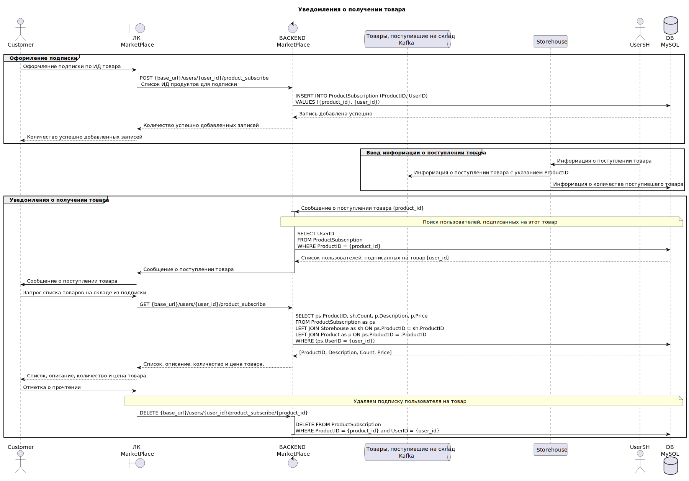

## Работа с уведомлениями о поступлении товара

### Ввод информации о поступлении товара

Ввод информации о поступлении товара осуществляется складским работником (на схеме `UserSH`) в собственной складской программе (на схеме `Storehouse`). При этом в топик `Товары, поступившие на склад` добавляется сообщение содержащее ProductID, а в таблице [Storehouse (Склад товара)](./ERD.md/#Storehouse (Склад товара)) появляется запись с указанием количества.

